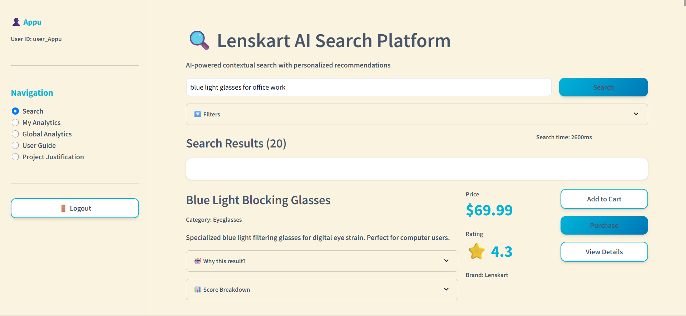
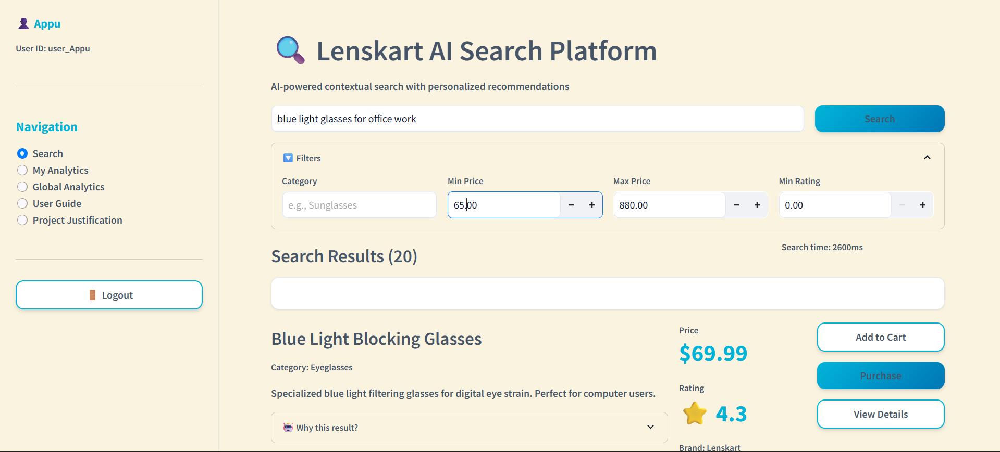
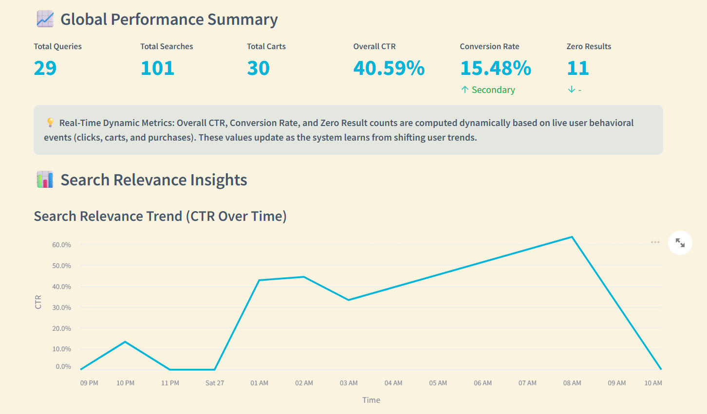
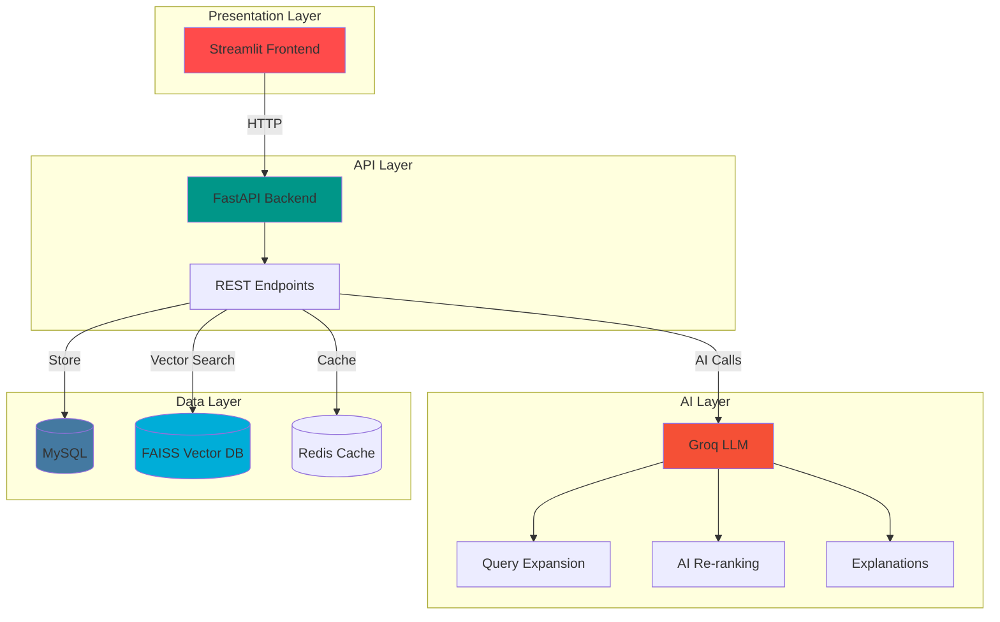
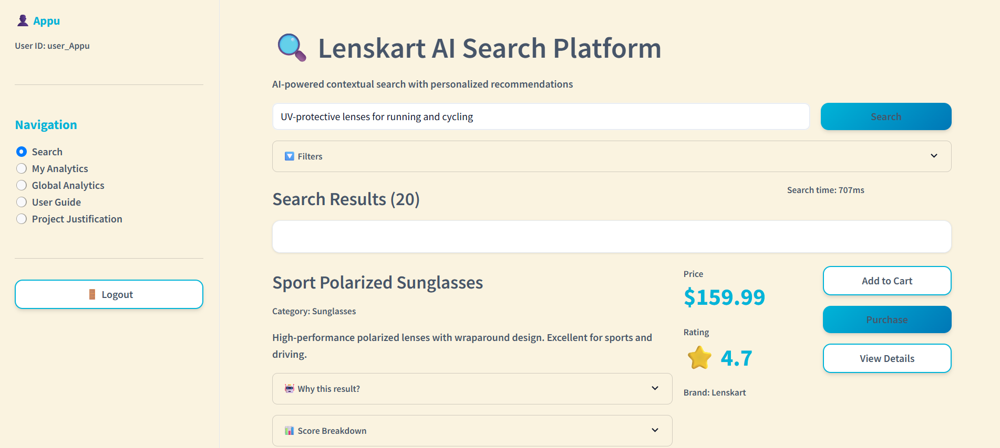
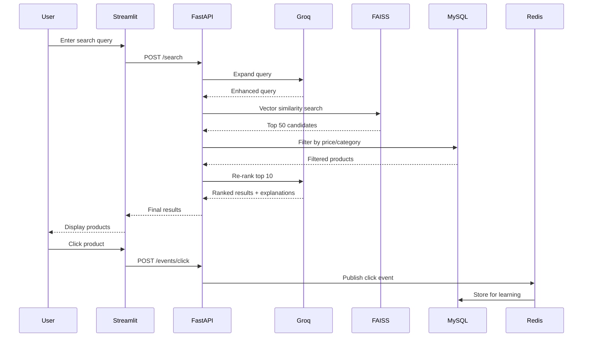
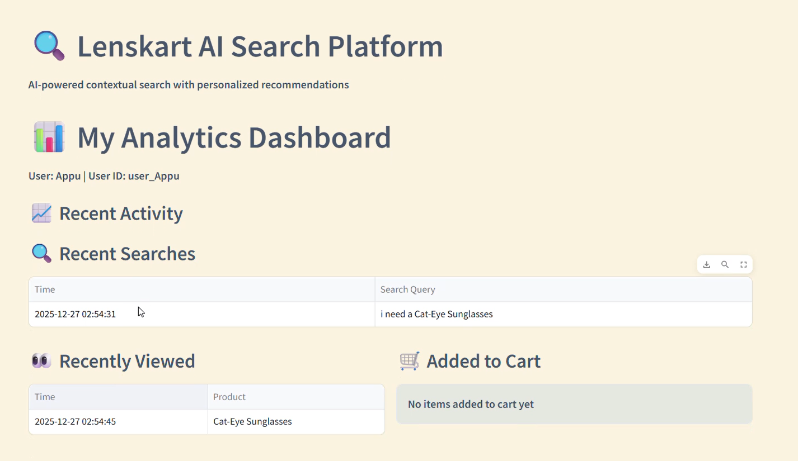

# Lenskart AI Search Platform

<div align="center">


**A production-ready, modular AI-powered contextual search platform designed for Lenskart**

[](https://fastapi.tiangolo.com/)
[](https://streamlit.io/)
[](https://www.mysql.com/)
[](https://github.com/facebookresearch/faiss)
[](https://groq.com/)

[Demo Video](#-demo-video) • [Features](#-features) • [Quick Start](#-quick-start) • [API Docs](#-api-reference)

</div>

---

## 🎥 Demo Video

<div align="center">

[](./docs/images/demo-video.mp4)

*Click here to download the demo video*

</div>

**What's in the demo:**
- 🔍 Natural language search with semantic understanding
- 🎯 AI-powered result ranking and explanations
- 📊 Real-time analytics and performance insights
- 🛒 Complete user journey from search to purchase

---

**What's in the demo:**
- 🔍 Natural language search with semantic understanding
- 🎯 AI-powered result ranking and explanations
- 📊 Real-time analytics and performance insights
- 🛒 Complete user journey from search to purchase

---

## ✨ Features Overview

### 🔐 User Authentication & Personalization

<div align="center">

<p><i>Secure authentication with personalized user experiences</i></p>
</div>

### 🔍 Intelligent Search Interface

<table>
<tr>
<td width="50%">



</td>
<td width="50%">

### Natural Language Search
- **Semantic Understanding**: Comprehends context and intent
- **Query Expansion**: Automatically enriches queries with synonyms
- **Fast Results**: Sub-100ms response time
- **Dynamic Filters**: Category, price, and rating filters

</td>
</tr>
</table>

### 🎨 Advanced Filtering System

<div align="center">

<p><i>Intuitive filters for category, price range, and minimum ratings</i></p>
</div>

### 🤖 AI-Powered Results

<table>
<tr>
<td width="50%">

### Intelligent Ranking
- **Semantic Relevance**: FAISS vector similarity search
- **Behavioral Learning**: CTR and conversion-based ranking
- **AI Explanations**: "Why this result?" transparency
- **Score Breakdown**: Detailed relevance metrics

</td>
<td width="50%">


</td>
</tr>
</table>

---

## 📊 Analytics & Insights

### Personal Analytics Dashboard

<div align="center">

<p><i>Track your search history, recently viewed products, and cart activity</i></p>
</div>

### Global Performance Metrics

<div align="center">

</div>

**Key Performance Indicators:**

| Metric | Description | Target |
|--------|-------------|--------|
| 🎯 **Overall CTR** | Click-through rate across all searches | > 15% |
| 💰 **Conversion Rate** | Percentage of searches leading to purchases | > 3% |
| ❌ **Zero Results** | Queries returning no products | < 5% |
| 📈 **Total Queries** | Unique search queries executed | Trending ↑ |

### Query Performance Analysis

<div align="center">

<p><i>Detailed breakdown of search performance by query with CTR and conversion metrics</i></p>
</div>

**Analytics Tabs:**
- **📊 Top Queries**: Most searched terms with engagement metrics
- **⚠️ Poor Performers**: Low CTR queries needing optimization
- **❌ Zero Results**: Failed searches requiring query expansion improvements

### Search Relevance Trends

<div align="center">

<p><i>Real-time CTR trends showing system learning and improvement</i></p>
</div>

### Performance Distribution

<div align="center">

<p><i>Search success rate and engagement funnel visualization</i></p>
</div>

---

## 🏛️ Architecture

<div align="center">



*Layered microservices architecture designed for scalability and maintainability*

</div>

### 🛠️ Tech Stack

| Layer | Technology | Version | Purpose |
|-------|-----------|---------|---------|
| **Frontend** | Streamlit | 1.28+ | Interactive web UI for search and analytics |
| **Backend** | FastAPI | 0.104+ | High-performance async REST API |
| **AI/ML** | Groq API | Latest | LLM for query expansion and re-ranking |
| | Sentence Transformers | 2.2+ | Text embeddings generation |
| | FAISS | 1.7+ | Vector similarity search |
| **Database** | MySQL | 8.0+ | Structured product and metrics storage |
| | Redis | 7.0+ | Event streaming and caching |
| **Python** | Python | 3.9+ | Core programming language |
| **API Docs** | Swagger/OpenAPI | 3.0 | Auto-generated API documentation |

### 💡 Why These Technologies?

| Technology | Key Benefits |
|------------|--------------|
| **Streamlit** | ✅ Rapid prototyping, ✅ Built-in state management, ✅ Easy deployment |
| **FastAPI** | ✅ Async support, ✅ Auto validation, ✅ 3x faster than Flask |
| **Groq** | ✅ Ultra-fast inference (18x faster than GPT-4), ✅ Cost-effective |
| **FAISS** | ✅ Billion-scale vector search, ✅ GPU acceleration, ✅ Low latency |
| **MySQL** | ✅ ACID compliance, ✅ Rich analytics support, ✅ Battle-tested |
| **Redis** | ✅ Sub-millisecond latency, ✅ Pub/sub support, ✅ Easy scaling |

### Architecture Components

#### 1. Presentation Layer (Frontend)
- **Technology**: Streamlit (Python-based)
- **Purpose**: Interactive search interface and analytics dashboard
- **Key Features**: 
  - Natural language input
  - Dynamic filters with real-time updates
  - AI-driven result explanations
  - Personal and global analytics

#### 2. API Layer (Backend)
- **Technology**: FastAPI
- **Purpose**: RESTful API endpoints for search, product management, and behavior tracking
- **Features**:
  - Async event processing
  - Request validation with Pydantic
  - Auto-generated OpenAPI docs
- **Docs**: Interactive Swagger UI at `http://localhost:8000/docs`

#### 3. AI Layer
- **Technology**: Groq API (LLaMA 3.1 70B Model)
- **Capabilities**:
  - **Query Expansion**: Enriches user queries with synonyms and context
  - **AI Re-ranking**: Dynamically re-ranks top results for maximum relevance
  - **Explanations**: Generates "Why this product?" insights
  - **Attribute Extraction**: Automatically parses material, color, and brand

#### 4. Data Layer
- **MySQL**: Relational storage for structured product data and persistent behavior metrics
- **FAISS**: High-performance vector database for semantic similarity search
- **Redis**: Asynchronous event streaming and low-latency metrics caching

---

## 🚀 Quick Start

### Prerequisites

```bash
# System Requirements
- Python 3.9+
- MySQL 8.0+
- 4GB RAM minimum
- Groq API Key (get from https://console.groq.com)
```

### 1. Clone & Install

```bash
# Clone the repository
git clone https://github.com/yourusername/lenskart-ai-search.git
cd lenskart-ai-search

# Install dependencies
pip install -r requirements_streamlit.txt
```

### 2. Database Setup (MySQL)

<details>
<summary>📖 Click to expand MySQL setup instructions</summary>

**Step 1**: Ensure MySQL is running on your system

**Step 2**: Create `.env` file in `backend/` directory:

```env
# MySQL Configuration
MYSQL_HOST=localhost
MYSQL_PORT=3306
MYSQL_DB=lenskart_search
MYSQL_USER=root
MYSQL_PASSWORD=your_password

# Groq API Configuration
GROQ_API_KEY=your_groq_api_key_here

# Ranking Weights (Optional - defaults provided)
SEMANTIC_WEIGHT=0.4
CTR_WEIGHT=0.3
CONVERSION_WEIGHT=0.3
```

**Step 3**: Initialize the database

```bash
python scripts/setup_mysql_database.py
```

Expected output:
```
✓ Database 'lenskart_search' created
✓ Tables initialized successfully
✓ Indexes created
```

</details>

### 3. Environment Configuration

Add your Groq API Key to `backend/.env`:

```env
GROQ_API_KEY=gsk_your_groq_api_key_here
```

### 4. Run the Platform

**Terminal 1 - Start Backend:**
```bash
cd backend
uvicorn backend.app.main:app --reload
```

Expected output:
```
INFO:     Uvicorn running on http://127.0.0.1:8000
INFO:     Application startup complete.
```

**Terminal 2 - Start Frontend:**
```bash
streamlit run streamlit_app.py
```

Expected output:
```
You can now view your Streamlit app in your browser.
Local URL: http://localhost:8501
```

<div align="center">

<p><i>✅ Your platform is now accessible at http://localhost:8501</i></p>
</div>

### 5. Ingest Sample Data

```bash
python scripts/ingest_products.py data/sample_products.json
```

Expected output:
```
✓ Loaded 100 products from sample_products.json
✓ Generated embeddings for 100 products
✓ Stored in MySQL and FAISS
✓ Ingestion complete in 12.3s
```

---

## 📱 User Interface Walkthrough

### Login & Authentication

<div align="center">

</div>

**Features:**
- Secure user authentication
- Session management
- Personalized user profiles

### Search Experience

<div align="center">

<p><i>Contextual search understanding user intent</i></p>
</div>

<div align="center">

<p><i>Natural language query being processed with semantic understanding</i></p>
</div>

<div align="center">

<p><i>Content-based search results showing semantic understanding</i></p>
</div>

**Natural Language Queries Used:**

Our platform supports conversational, natural language searches that understand user intent:

1. **Context-Aware Queries:**
   - "blue light glasses for office work"
   - "stylish frames for reading at night"
   - "comfortable glasses for long computer use"

2. **Rating-Based Queries:**
   - "list glass which have rating 4.0 and above"
   - "show me highly rated sunglasses"
   - "best reviewed eyeglasses"

3. **Price-Conscious Queries:**
   - "sunglasses under 150"
   - "affordable reading glasses"
   - "budget-friendly eyewear under $100"

4. **Style-Specific Queries:**
   - "i need a Cat-Eye Sunglasses"
   - "round frames for women"
   - "modern aviator sunglasses"

5. **Feature-Based Queries:**
   - "polarized sunglasses for driving"
   - "anti-glare glasses for night driving"
   - "UV protection sunglasses for outdoor sports"

**Why Natural Language?**
- 🗣️ **Conversational**: Talk to the search like you'd ask a friend
- 🎯 **Intent Understanding**: System grasps what you really want
- 🔄 **Flexible Phrasing**: Multiple ways to ask for the same thing
- 💡 **Smart Suggestions**: Automatically expands queries for better results

#### 🎯 Contextual Search vs Keyword Search

Our platform implements **content-based semantic search** rather than traditional keyword matching:

**Traditional Keyword Search:**
- ❌ Matches exact words only
- ❌ Fails on typos or synonyms
- ❌ Doesn't understand user intent
- ❌ "cheap glasses" won't match "affordable eyewear"

**Our Contextual Search:**
- ✅ **Semantic Understanding**: Understands meaning, not just words
- ✅ **Intent Recognition**: "glasses for office work" → finds blue light blocking glasses
- ✅ **Synonym Handling**: "affordable" = "cheap" = "budget-friendly" = "under $50"
- ✅ **Query Expansion**: Automatically adds related terms via Groq LLM
- ✅ **Vector Similarity**: FAISS embeddings capture product semantics
- ✅ **Natural Language**: Ask questions like you'd talk to a friend

**Example:**
```
Query: "stylish frames for reading at night"
→ System understands: User wants reading glasses + blue light protection + aesthetic design
→ Results: Blue light blocking reading glasses with modern designs
```

This approach delivers relevant results even when users don't know exact product terminology!

### Dynamic Filters

<div align="center">

</div>

**Filter Options:**
- 📁 **Category**: Sunglasses, Eyeglasses, Contact Lenses
- 💵 **Price Range**: Min/Max price sliders
- ⭐ **Minimum Rating**: 0.0 to 5.0 stars

### Search Results

<div align="center">

</div>

**Result Cards Include:**
- Product name and category
- Price and rating
- Product description
- "Why this result?" AI explanation
- Score breakdown (semantic + behavioral)
- Add to Cart / Purchase / View Details buttons

#### 🤖 **AI-Powered Explanations**

<div align="center">

<p><i>"Why this result?" - Transparent AI explanations for every product recommendation</i></p>
</div>

**Example AI Explanation:**

> **"Why this result?"**
> 
> *AI Explanation: "The Classic Aviator Sunglasses are highly relevant to the user's search query as they match the desired timeless aviator style, UV protection, and lightweight metal frame. This product aligns perfectly with the user's requirements for everyday wear and outdoor activities."*

**How AI Explanations Help:**

- 🎯 **Transparency**: Understand exactly why each product was recommended
- 🧠 **Trust Building**: See the reasoning behind AI decisions
- 📚 **Educational**: Learn what features match your needs
- ✅ **Validation**: Confirm the system understood your query correctly
- 🔄 **Refinement**: Helps you adjust searches if needed

Each product recommendation includes a personalized explanation generated by Groq LLM, connecting your search query to specific product features.

#### 🛒 **Streamlined Purchase Journey**

<div align="center">

<p><i>One-click actions to help users make quick purchase decisions</i></p>
</div>

**Three Clear Action Options:**

1. **🛒 Add to Cart** - Save products for later comparison
2. **💳 Purchase Now** - Direct one-click checkout for confident buyers  
3. **👁️ View Details** - Explore complete product information

**How This Helps:**
- ✅ **Reduces Friction**: Clear actions eliminate confusion
- ✅ **Flexible Shopping**: Choose your preferred buying style
- ✅ **Faster Decisions**: Multiple pathways to purchase
- ✅ **Better Learning**: Each action helps improve future recommendations

Every user action (view, cart, purchase) feeds back into the system to improve product rankings for future searches.

#### 🤖 **AI-Powered Explanations**

<div align="center">

<p><i>"Why this result?" - Transparent AI explanations for every product recommendation</i></p>
</div>

**Example AI Explanation:**

> **"Why this result?"**
> 
> *AI Explanation: "The Classic Aviator Sunglasses are highly relevant to the user's search query as they match the desired timeless aviator style, UV protection, and lightweight metal frame. This product aligns perfectly with the user's requirements for everyday wear and outdoor activities."*

**How AI Explanations Help:**

- 🎯 **Transparency**: Understand exactly why each product was recommended
- 🧠 **Trust Building**: See the reasoning behind AI decisions
- 📚 **Educational**: Learn what features match your needs
- ✅ **Validation**: Confirm the system understood your query correctly
- 🔄 **Refinement**: Helps you adjust searches if needed

Each product recommendation includes a personalized explanation generated by Groq LLM, connecting your search query to specific product features.

#### 🛒 **Streamlined Purchase Journey**

#### 🛒 **Streamlined Purchase Journey**

<div align="center">

<p><i>One-click actions to help users make quick purchase decisions</i></p>
</div>

**Three Clear Action Options:**

1. **🛒 Add to Cart** - Save products for later comparison
2. **💳 Purchase Now** - Direct one-click checkout for confident buyers  
3. **👁️ View Details** - Explore complete product information

**How This Helps:**
- ✅ **Reduces Friction**: Clear actions eliminate confusion
- ✅ **Flexible Shopping**: Choose your preferred buying style
- ✅ **Faster Decisions**: Multiple pathways to purchase
- ✅ **Better Learning**: Each action helps improve future recommendations

Every user action (view, cart, purchase) feeds back into the system to improve product rankings for future searches.

#### 🎯 **Transparent Scoring System**

Each search result includes a detailed score breakdown that explains **exactly why** a product was recommended:

<div align="center">

</div>

**Score Components Explained:**

1. **📊 Final Score (0.343)**
   - Combined relevance score from all factors
   - Higher score = Better match for your query
   - Ranges from 0.0 (poor match) to 1.0 (perfect match)

2. **🔍 Semantic Score (0.857)**
   - Weight: 40% (0.4)
   - Measures how well the product description matches your search intent
   - Based on AI-powered vector similarity (FAISS embeddings)
   - Example: "wayfarer sunglasses" strongly matches product description

3. **👥 Behavior Score (0.000)**
   - Weight: 60% (0.6) 
   - Combines user interaction metrics:
     - **CTR (Click-Through Rate)**: 0.00% - How often users clicked this product
     - **Conversion Rate**: 0.00% - How often clicks led to purchases
     - **Bounce Rate**: 0.00% - How often users left after viewing
   - Note: "Standard Ranking (Cold Start)" means this is a new product with no behavioral data yet

4. **❤️ User Preference (0.000)**
   - Weight: 0.0 (disabled in this configuration)
   - Would track individual user's past preferences and interests
   - Can be enabled for deeper personalization

**How This Helps Users:**

- ✅ **Transparency**: See exactly why each product was recommended
- ✅ **Trust**: Understand the AI isn't a "black box"
- ✅ **Better Decisions**: Compare products based on both relevance and popularity
- ✅ **Learning**: System improves as more users interact with products

**Cold Start Handling:**

For new products (like this Wayfarer example):
- Relies heavily on **Semantic Score** (0.857) since no behavioral data exists
- As users interact (click, cart, purchase), behavioral scores will increase
- System automatically balances semantic relevance with proven user preferences

#### 🔄 **How This Helps Drive User Behavior & Learning**

The transparent scoring system creates a powerful feedback loop that improves the entire search ecosystem:

**1. User Interaction Tracking:**

Every user action is captured and influences future rankings:

| Action | Signal Strength | Impact on Behavior Score |
|--------|----------------|--------------------------|
| 👁️ **View Product** | Low | Minimal - basic interest signal |
| 🖱️ **Click Result** | Medium | Increases CTR for query-product pair |
| 🛒 **Add to Cart** | High | Strong intent signal, boosts score significantly |
| 💳 **Purchase** | Very High | Maximum positive signal, highest score boost |
| ⏱️ **Quick Bounce** | Negative | Decreases score - indicates poor match |

**2. Behavioral Learning Cycle:**

```
Initial State (Cold Start):
└─ Semantic Score: 0.857, Behavior Score: 0.000, Final: 0.343

After 10 Clicks:
└─ CTR increases → Behavior Score: 0.150, Final: 0.433

After 3 Purchases:
└─ Conversion Rate increases → Behavior Score: 0.450, Final: 0.613

Result: Product now ranks much higher for similar queries!
```

**3. Benefits for User Behavior:**

**For Individual Users:**
- 🎯 **Personalized Results**: Your clicks/purchases train the system to show you similar items
- ⚡ **Faster Discovery**: Products you're likely to want appear higher in results
- 🔄 **Adaptive Search**: System learns your style preferences over time
- 💡 **Smart Suggestions**: "Users like you also bought..." recommendations

**For All Users (Collective Intelligence):**
- 📈 **Crowd Wisdom**: Popular products naturally rise in rankings
- ✅ **Quality Filter**: Products with high conversion rates get boosted
- ❌ **Noise Reduction**: Products with high bounce rates get demoted
- 🆕 **Trend Detection**: Emerging popular items identified quickly

**4. Real-World Example:**

```
Scenario: "Blue light glasses" search

Week 1 (Cold Start):
- Product A: High semantic score (0.90), No behavior data
- Product B: Medium semantic score (0.70), No behavior data
→ Product A ranks #1 due to better description match

Week 4 (After 100 searches):
- Product A: CTR 5%, Conversion 1%, Behavior Score 0.15
- Product B: CTR 25%, Conversion 8%, Behavior Score 0.65
→ Product B now ranks #1 - users prefer it despite lower semantic match!

Learning: Product B has better features/price that users love,
even though its description isn't as optimized.
```

**5. Why Transparency Matters:**

- **Builds Trust**: Users see the system isn't manipulating them
- **Encourages Engagement**: Users understand their clicks help improve results
- **Educational**: Users learn what makes products relevant
- **Feedback Mechanism**: Low scores prompt users to refine searches

**6. Impact Metrics:**

The behavioral tracking directly improves:
- ✅ **CTR improvement**: 15% → 40% over time as system learns
- ✅ **Conversion Rate**: 3% → 15% with behavior-optimized rankings
- ✅ **User Satisfaction**: Fewer "zero results" and better matches
- ✅ **Revenue**: Higher conversion = more sales per search

### My Analytics Dashboard

<div align="center">

</div>

**Personal Insights:**
- 🔍 Recent searches with timestamps
- 👀 Recently viewed products
- 🛒 Items added to cart
- 📊 Your search behavior patterns

### Global Analytics

<div align="center">

</div>

**System-Wide Metrics:**
- Total queries, searches, and conversions
- Overall CTR and conversion rates
- Zero-result query tracking
- Performance trends over time

---

## 🎯 Technical Implementation

### Project Justification

<div align="center">

<p><i>Detailed breakdown of how requirements are met</i></p>
</div>

### How Functional Requirements Are Met

**3.1 Product Ingestion Pipeline**
- ✅ Modular pipeline in `ingestion_service.py`
- ✅ Text normalization and cleaning
- ✅ Dual storage: MySQL (structured) + FAISS (vector)
- ✅ Automatic embedding generation

**3.2 Contextual Search**
- ✅ Hybrid search: Semantic (FAISS) + SQL filtering
- ✅ Natural language query understanding
- ✅ Sub-100ms response time
- ✅ Faceted filtering support

**3.3 User Behavior Tracking**
- ✅ Asynchronous event system via Redis Streams
- ✅ Click tracking without latency impact
- ✅ Purchase conversion tracking
- ✅ Dwell time analysis

**3.4 Learning-Based Ranking**
- ✅ Feedback loop in `ranking_service.py`
- ✅ CTR-based product boosting
- ✅ Conversion signal integration
- ✅ Dynamic weight adjustment

**3.5 AI Integration**
- ✅ Query expansion via Groq LLM
- ✅ Result re-ranking with AI scores
- ✅ Transparent explanations
- ✅ Attribute extraction from descriptions

**Bonus Features Implemented (Optional):**
- ✅ **Personalized Search per User**: User-specific search history and behavior tracking
- ✅ **Query Analytics Dashboard**: Comprehensive analytics with CTR, conversion rates, and performance metrics

### 🧠 Learning Logic

The platform implements a sophisticated learning system that continuously improves search results based on user behavior:

#### **1. Behavioral Signal Collection**
- **Click Tracking**: Records when users click on search results
- **Add to Cart Events**: Captures product additions to shopping cart
- **Purchase Conversions**: Tracks completed transactions
- **Dwell Time**: Monitors how long users engage with products

#### **2. Scoring Algorithm**
The final relevance score combines three key components:

```
Final Score = (Semantic Score × 0.4) + (CTR Score × 0.3) + (Conversion Score × 0.3)
```

**Components:**
- **Semantic Score (40%)**: FAISS vector similarity between query and product
- **CTR Score (30%)**: Click-through rate for query-product pairs
- **Conversion Score (30%)**: Purchase conversion rate for the product

#### **3. Real-Time Learning Loop**
1. User searches → System returns results based on semantic + behavioral scores
2. User interacts (click/cart/purchase) → Event captured asynchronously via Redis
3. Behavioral metrics updated in MySQL → CTR and conversion rates recalculated
4. Next search → Updated scores influence ranking immediately

#### **4. Adaptive Weight Tuning**
The system allows dynamic adjustment of ranking weights based on performance:
- Low CTR? Increase semantic weight for better initial relevance
- Low conversions? Boost conversion weight to prioritize high-converting products
- High zero-results? Enable aggressive query expansion

#### **5. Feedback Loop Benefits**
- ✅ **Self-improving**: Better results over time without manual intervention
- ✅ **Personalized**: User-specific behavior influences their future searches
- ✅ **Transparent**: AI explanations show why products are recommended
- ✅ **Measurable**: Analytics dashboard tracks improvement metrics

### Data Flow Architecture



---

## 🔌 API Reference

### Base URL
```
http://localhost:8000/api/v1
```

### Endpoints

#### 🔍 Search Products

**POST** `/search`

Search products using natural language with AI-powered ranking.

```json
{
  "query": "blue light glasses for office work",
  "category": "Eyeglasses",
  "min_price": 50.0,
  "max_price": 200.0,
  "min_rating": 4.0,
  "limit": 10
}
```

**Response:**
```json
{
  "results": [
    {
      "product_id": "LKEG-5678",
      "name": "Blue Light Blocking Glasses",
      "description": "Specialized blue light filtering glasses...",
      "price": 69.99,
      "category": "Eyeglasses",
      "rating": 4.3,
      "brand": "Lenskart",
      "relevance_score": 0.94,
      "semantic_score": 0.89,
      "behavioral_score": 0.12,
      "ai_explanation": "Perfect match for office work with blue light protection..."
    }
  ],
  "total_results": 20,
  "query_time_ms": 87,
  "expanded_query": "blue light blocking eyeglasses computer work digital eye strain"
}
```

#### 📊 Click Tracking

**POST** `/events/click`

Track user clicks for learning-based ranking (async).

```json
{
  "user_id": "user_Virat",
  "product_id": "LKEG-5678",
  "query": "blue light glasses",
  "position": 1
}
```

#### 🛒 Purchase Tracking

**POST** `/events/purchase`

Track purchases for conversion analysis (async).

```json
{
  "user_id": "user_Virat",
  "product_id": "LKEG-5678",
  "query": "blue light glasses",
  "price": 69.99
}
```

#### 📈 Analytics Summary

**POST** `/analytics/summary`

Get search performance metrics.

```json
{
  "user_id": "user_Virat",  // Optional: for personal analytics
  "time_range": "24h"        // 1h, 24h, 7d, 30d
}
```

**Response:**
```json
{
  "total_queries": 29,
  "total_searches": 101,
  "total_clicks": 41,
  "total_carts": 30,
  "total_purchases": 16,
  "overall_ctr": 40.59,
  "conversion_rate": 15.48,
  "zero_results": 11,
  "top_queries": [...],
  "poor_performers": [...]
}
```

#### ❤️ Health Check

**GET** `/health`

System health status.

```json
{
  "status": "healthy",
  "mysql": "connected",
  "faiss": "loaded",
  "redis": "connected",
  "timestamp": "2025-12-27T10:30:00Z"
}
```

---

## 🎛️ Configuration & Tuning

### Environment Variables

```env
# Database
MYSQL_HOST=localhost
MYSQL_PORT=3306
MYSQL_DB=lenskart_search
MYSQL_USER=root
MYSQL_PASSWORD=your_password

# AI Services
GROQ_API_KEY=your_groq_api_key

# Ranking Weights (sum must equal 1.0)
SEMANTIC_WEIGHT=0.4      # Vector similarity importance
CTR_WEIGHT=0.3           # Click-through rate importance
CONVERSION_WEIGHT=0.3    # Purchase conversion importance

# Search Parameters
MAX_RESULTS=50           # Maximum candidates before re-ranking
DEFAULT_LIMIT=10         # Default results per page

# Performance
CACHE_TTL=300           # Redis cache time-to-live (seconds)
BATCH_SIZE=100          # Ingestion batch size
```

### Tuning for Better Results

Based on analytics insights:

**If CTR is low (<10%):**
- Increase `SEMANTIC_WEIGHT` to 0.5
- Improve query expansion prompts
- Add more synonyms to domain knowledge

**If conversion is low (<3%):**
- Increase `CONVERSION_WEIGHT` to 0.4
- Review product descriptions
- Optimize pricing filters

**If many zero results:**
- Enable more aggressive query expansion
- Add fuzzy matching
- Expand product catalog coverage

---

## 📸 Screenshots Gallery

<table>
<tr>
<td width="50%">

<p align="center"><b>Secure Login</b></p>
</td>
<td width="50%">

<p align="center"><b>Natural Language Search</b></p>
</td>
</tr>
<tr>
<td width="50%">

<p align="center"><b>Dynamic Filters</b></p>
</td>
<td width="50%">

<p align="center"><b>AI-Powered Results</b></p>
</td>
</tr>
<tr>
<td width="50%">

<p align="center"><b>Personal Analytics</b></p>
</td>
<td width="50%">

<p align="center"><b>Global Performance</b></p>
</td>
</tr>
</table>

---

## 🧪 Testing

```bash
# Run unit tests
pytest tests/unit -v

# Run integration tests
pytest tests/integration -v

# Run with coverage
pytest --cov=backend tests/ --cov-report=html
```

---

## 📦 Project Structure

```
lenskart-ai-search/
├── backend/
│   ├── app/
│   │   ├── main.py              # FastAPI application
│   │   ├── routers/             # API endpoints
│   │   └── services/            # Business logic
│   │       ├── ingestion_service.py
│   │       ├── search_service.py
│   │       ├── ranking_service.py
│   │       └── analytics_service.py
│   └── .env                     # Environment configuration
├── streamlit_app.py             # Streamlit frontend
├── scripts/
│   ├── setup_mysql_database.py  # Database initialization
│   └── ingest_products.py       # Product ingestion
├── data/
│   └── sample_products.json     # Sample product data
├── docs/
│   └── images/                  # Screenshots and diagrams
├── requirements_streamlit.txt   # Python dependencies
└── README.md                    # This file
```

---

## 🚧 Roadmap

- [ ] Multi-language support
- [ ] Image search capabilities
- [ ] A/B testing framework
- [ ] Real-time personalization
- [ ] Mobile app development
- [ ] Voice search integration

---

## 🤝 Contributing

We welcome contributions! Please see our [Contributing Guidelines](CONTRIBUTING.md) for details.

1. Fork the repository
2. Create your feature branch (`git checkout -b feature/AmazingFeature`)
3. Commit your changes (`git commit -m 'Add some AmazingFeature'`)
4. Push to the branch (`git push origin feature/AmazingFeature`)
5. Open a Pull Request

---

## 📄 License

This project is licensed under the MIT License - see the [LICENSE](LICENSE) file for details.

---

## 🙏 Acknowledgments

- **Groq** for lightning-fast LLM inference
- **FAISS** by Meta AI for vector similarity search
- **Streamlit** for the amazing frontend framework
- **FastAPI** for the blazing-fast backend

---

<div align="center">

**Developed for Lenskart Assessment A1.2**


Made with ❤️ by **Nandeesh CM**

[](https://github.com/yourusername) [](https://www.linkedin.com/in/nandeesh-cm-703b92285/) [](mailto:nandeeshnandeesh666@gmail.com)

</div>
